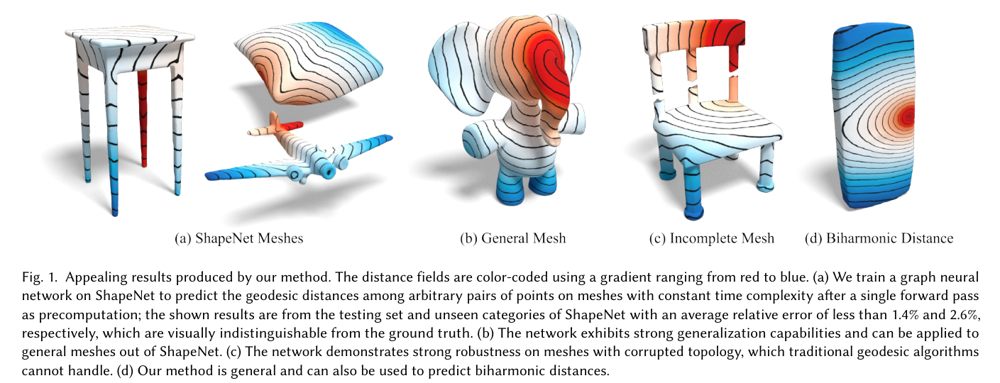
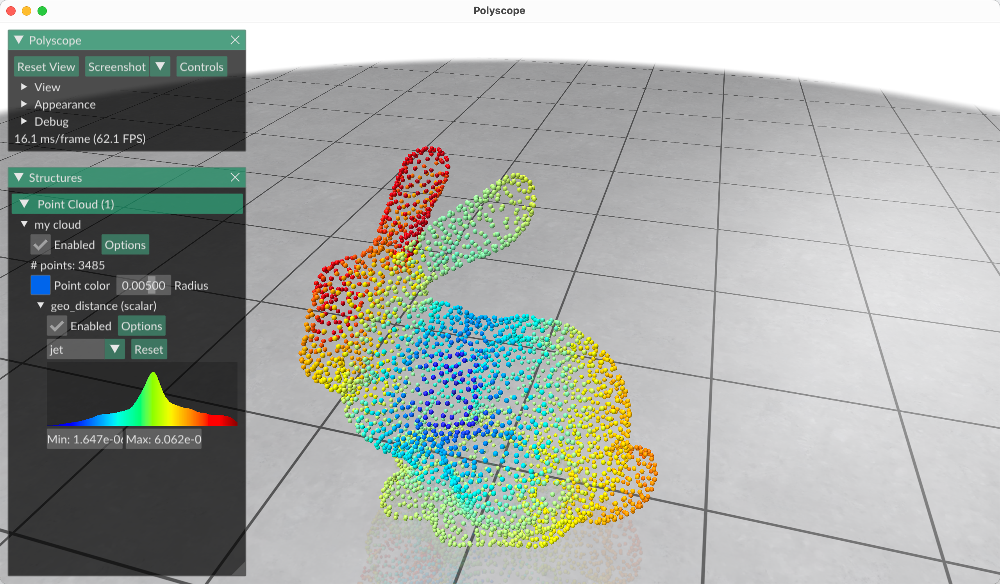

# Learning the Geodesic Embedding with Graph Neural Networks


[**Learning the Geodesic Embedding with Graph Neural Networks**](https://dl.acm.org/doi/10.1145/3618317)

[Bo Pang](https://github.com/skinboC), [Zhongtian Zheng](https://github.com/zzttzz), Guoping Wang, and [Peng-Shuai Wang](https://wang-ps.github.io/)

ACM Transactions on Graphics (SIGGRAPH Asia), 42(6), 2023



- [Learning the Geodesic Embedding with Graph Neural Networks](#learning-the-geodesic-embedding-with-graph-neural-networks)
  - [1. Environment](#1-environment)
  - [2. Prepare Data](#2-prepare-data)
  - [3. Train](#3-train)
  - [4. Test and Visualization](#4-test-and-visualization)
  - [5. Citation](#5-citation)


## 1. Environment

First, please install pytorch that fits your cuda version.

Then, install torch geometric:

```
conda install pyg -c pyg 
```

Then install the packages required by this project:

```
pip3 install -r requirements.txt
```

## 2. Prepare Data

Before training, you have to generate training data, as described in 4.1 of the paper. Please note the model may not generalize well on shapes very different from the training data, as suggested in the paper.

Suppose you have your meshes in `path/to/meshes`, we provide a script to generate training data from these meshes. Please open `utils/dataset_prepare/py_data_generator.py`, and change the following lines:

```python
PATH_TO_MESH = "path/to/your/mesh/folder/"
PATH_TO_OUTPUT_NPZ = "path/to/your/output/folder/"
PATH_TO_OUTPUT_FILELIST = "path/to/your/another/output/folder"
```

Then, please run the script:

```
python utils/dataset_prepare/py_data_generator.py
```

This will load meshes (.obj files) and generate the processed `.npz` files. You can change `a, b, c, d` in that file to adjust the property of training data.

We will upload the processed data we used in our paper to Google Drive soon.

There is also a mesh processing script in `utils/dataset_prepare/simplifiy.py`, which is a utility tool we used to process the meshes.

## 3. Train

To train the network, you can type:

```shell
python3 GnnDist.py --config configs/gnndist_test.yaml
```

We train our model on Ubuntu 20.04 (4 Nvidia 3090 GPUs, 24GB VRAM) with batch size 10. If your GPU memory is not enough, please reduce the batch size in the config file.

A checkpoint of our model is provided in `pretrained/ours00500.solver.tar`.

## 4. Test and Visualization



We provide a script to test the network and visualize the results. The following command tests our method on the specified mesh and will open a polyscope window for visualization. (If you are using ssh and cannot open the window, please delete polyscope-related code in `GeGnn_standalong.py`.)

Feel free to change `--test_file` to test on other meshes and change `--start_pts` to test on different source points.

```shell
python3 GeGnn_standalong.py --mode SSAD --test_file data/test_mesh/bunny.obj --ckpt_path pretrained/ours00500.solver.tar --start_pts 0 --output out/ssad_ours.npy
```

This will open a polyscope window and show the results. 

## 5. Citation

If you find this project useful for your research, please kindly cite our paper:

```bibtex 
@article{pang2023gegnn,
  title={Learning the Geodesic Embedding with Graph Neural Networks},
  author={Pang, Bo and Zheng, Zhongtian and Wang, Guoping and Wang, Peng-Shuai},
  journal={ACM Transactions on Graphics (SIGGRAPH Asia)},
  year={2023}

}
```

If you have any questions, please feel free to contact us at bo98@stu.pku.edu.cn
